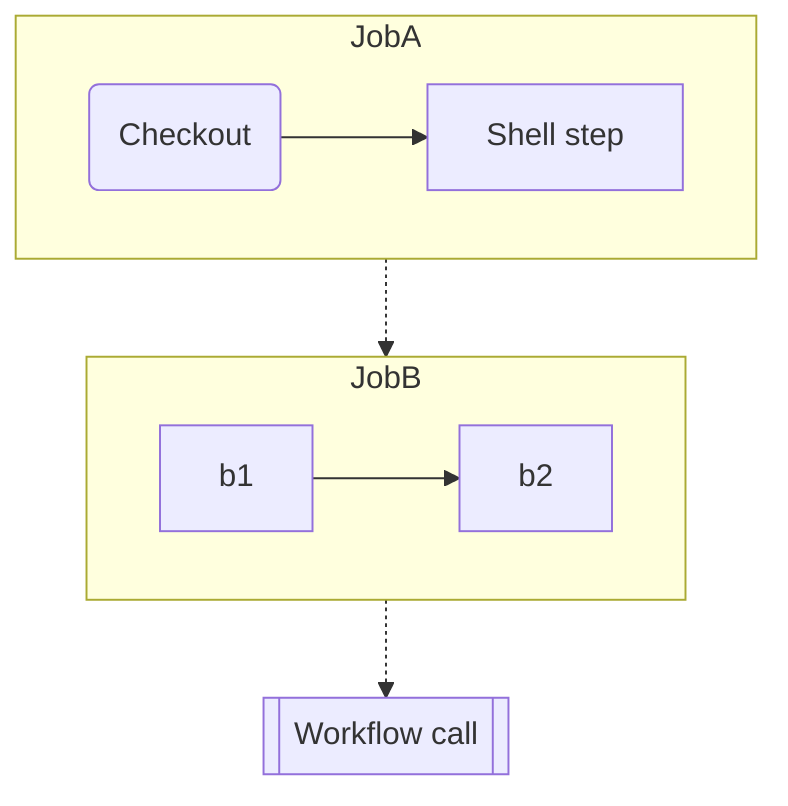

# General options

??? info "Example action/workflow"

    ??? preview "compsite action `action.yaml`"

        ```yaml title="action.yaml"
        --8<-- "action.yaml"
        ```

    ??? preview "reusable workflow `.github/workflows/example_workflow.yml`"

        ```yaml title=".github/workflows/example_workflow.yml"
        --8<-- ".github/workflows/example_workflow.yml"
        ```


::: mkdocstrings_handlers.github.config.GitHubOptions.show_description
    handler: python

??? preview

    === "`show_description: true`"

        ::: .
            options:
                show_description: true

    === "`show_description: false`"

        ::: .
            options:
                show_description: false

::: mkdocstrings_handlers.github.config.GitHubOptions.description
    handler: python

??? preview

    === "`description: ''`"

        ::: .

    === "`description: 'A custom description'`"

        ::: .
            options:
               description: 'A custom description'

::: mkdocstrings_handlers.github.config.GitHubOptions.show_source
    handler: python

??? preview

    === "`show_source: true`"

        ::: .
            options:
                show_source: true

    === "`show_source: false`"

        ::: .
            options:
                show_source: false

::: mkdocstrings_handlers.github.config.GitHubOptions.workflow_chart
    handler: python

In order to display the mermaid diagram, you'll need to setup the configuration for [Mermaid.js](https://mermaid.ai/) in [mkdocs-material](https://squidfunk.github.io/mkdocs-material/reference/diagrams/#configuration) or via [mkdocs-mermaid2](https://mkdocs-mermaid2.readthedocs.io). Following the instructions in the linked pages to configure your `mkdocs.yml`. Additionally, we recommend setting up [Panzoom for MkDocs](https://github.com/PLAYG0N/mkdocs-panzoom), which allows zooming into the displayed diagram. 

In the output diagram, each step in a job is represented as a node, jobs are represented as groups, and dependencies between jobs are displayed as edges between groups. Steps that call actions are rounded. Jobs that call another workflow are shown as a subroutine. Jobs and steps without `name` are **omitted** from the graph.



??? preview

    === "`workflow_chart: true`"

        ::: .github/workflows/example_workflow.yml
            options:
                workflow_chart: true

    === "`workflow_chart: false`"

        ::: .github/workflows/example_workflow.yml
            options:
                workflow_chart: false

::: mkdocstrings_handlers.github.config.GitHubOptions.workflow_chart_step_direction
    handler: python

??? preview

    === "`workflow_chart_step_direction: 'TB'`"

        ::: .github/workflows/example_workflow.yml
            options:
                workflow_chart: true
                workflow_chart_step_direction: 'TB'

    === "`workflow_chart_step_direction: 'LR'`"

        ::: .github/workflows/example_workflow.yml
            options:
                workflow_chart: true
                workflow_chart_step_direction: 'LR'
